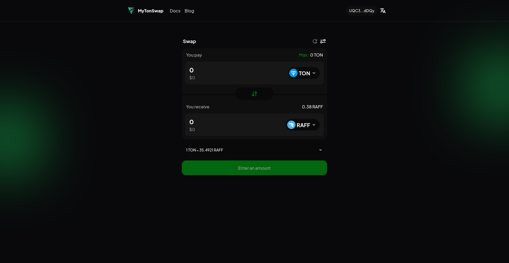

# MyTonSwap App



## Overview

MyTonSwap is a decentralized exchange platform on the TON blockchain, providing instant token swaps with the best rates and high liquidity.

## Getting Started

### Prerequisites

-   Node.js (version 20.x)
-   pnpm (version 7.x)

### Installation

1. Clone the repository:

    ```sh
    git clone https://github.com/mytonswap/app.git
    cd mytonswap-frontend
    ```

2. Install dependencies:
    ```sh
    pnpm install
    ```

### Running the Application

To start the development server, run:

```sh
pnpm run dev
```
